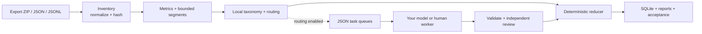

<div align="center">


<h1>ChatGPT Export Analysis</h1>

<p><strong>Turn your ChatGPT export into a reproducible, queryable, evidence-linked corpus.</strong></p>

<p>
  Normalize the selected conversation branch, measure the corpus, apply your own taxonomy,
  and trace every coded finding back to the source turn—without sending transcript text anywhere by default.
</p>

<p>
  <a href="https://github.com/alsi-lawr/chatgpt-analysis/actions/workflows/ci.yml"></a>
  <a href="pyproject.toml"></a>
  <a href="pyproject.toml"></a>
</p>

<p>
  <a href="#quick-start">Quick start</a> ·
  <a href="#how-the-pipeline-works">Pipeline</a> ·
  <a href="#configuration-controls-the-claims">Configuration</a> ·
  <a href="#optional-model-or-human-workers">Workers</a> ·
  <a href="#security-and-interpretation-boundaries">Boundaries</a>
</p>

</div>

> [!IMPORTANT]
> **Your export stays local unless you deliberately run an external worker.** The deterministic pipeline uses only Python's standard library and contains no hosted-model SDK. Worker task payloads include transcript text, so inspect them before connecting any model provider.

## Your export is data. This makes it an analysis corpus.

A ChatGPT export gives you conversation records, not a trustworthy research workflow. Branches can be traversed inconsistently, long chats exceed useful review windows, keyword counts are easy to overinterpret, and model-generated labels can lose their connection to the text that supposedly supports them.

ChatGPT Export Analysis turns that dump into a reviewable workspace:

- **Stable normalization** follows the selected branch and assigns deterministic conversation and turn identities.
- **Reproducible local analysis** computes inventories, distributions, periods, length buckets, segments, and configured pattern cards.
- **Evidence-linked coding** requires labels, hypotheses, and observations to cite in-scope turn IDs.
- **Explicit automation boundaries** keep model providers outside the core pipeline behind JSON task queues.
- **Deterministic review consolidation** unions additive coding and evidence, retains hypothesis-rating sensitivity ranges, keeps primary-reviewer relevance canonical, and makes every third review audit-only.
- **Acceptance checks** rehash source files and verify transcript digests, evidence references, report configuration, SQLite row counts, and database integrity.

### At a glance

| | |
|---|---|
| **Use it for** | Auditing and exploring patterns in your own ChatGPT export |
| **Inputs** | Export ZIP, JSON, JSONL, or a directory containing supported conversation files |
| **Outputs** | Normalized JSONL, deterministic metrics, evidence cards, Markdown/JSON reports, SQLite, and optional FTS5 |
| **Model use** | Optional and provider-neutral; a model or human-coded executable reads JSON on stdin and writes JSON on stdout |
| **Runtime** | Python 3.11+ with no third-party runtime dependencies |

## Quick start

### 1. Install from a clone

```bash
git clone https://github.com/alsi-lawr/chatgpt-analysis.git
cd chatgpt-analysis

python -m venv .venv
. .venv/bin/activate
python -m pip install .

chatgpt-analysis --version
```

For editable development, use `python -m pip install -e .` instead.

### 2. Create an analysis project

```bash
chatgpt-analysis init my-analysis
cd my-analysis
```

The scaffold contains:

```text
my-analysis/
├── analysis.json
├── taxonomy.json
├── prompts/
│   ├── adjudication.md  # legacy third-review audit contract
│   ├── reducer.md
│   ├── review.md
│   ├── signals.md
│   └── triage.md
└── schemas/
    ├── model-output.schema.json
    └── task.schema.json
```

The prompt and schema files are worker-facing reference copies. Task payloads carry the tool version's current instructions and output schema; editing the copied Markdown prompts does not change generated tasks.

Put the export at `export.zip` inside this directory, or change `source.path` in `analysis.json` to the absolute or project-relative location of your export. The generated configuration is ready for a local-only run; edit `taxonomy.json` when you want project-specific coding.

### 3. Run the local pipeline

```bash
chatgpt-analysis run --config analysis.json
```

`run` normalizes the export, calculates metrics, builds segments and deterministic cards, reduces the results, recreates SQLite, writes reports, and performs acceptance checks. It never invokes a model; with routing disabled—the generated default—it also emits no model tasks.

### 4. Inspect the result

Start with these artifacts:

| Artifact | What it answers |
|---|---|
| `workspace/reports/summary.md` | What is in the corpus, which configured labels matched, and what limitations apply? |
| `workspace/reports/summary.json` | What are the same results in machine-readable form? |
| `workspace/audits/acceptance.json` | Did source, evidence, configuration, and index consistency checks pass? |
| `workspace/index/analysis.sqlite` | How can I query conversations, turns, segments, cards, and evidence directly? |
| `workspace/normalized/turns.jsonl` | Which canonical turn does an evidence link refer to? |

```bash
cat workspace/reports/summary.md
python -m json.tool workspace/audits/acceptance.json
```

`accept` exits nonzero for failed checks. Pending worker tasks and quarantined outputs are reported as warnings rather than disguised as completed analysis.

## How the pipeline works



Every stage is available independently, which is useful when developing a taxonomy, diagnosing an adapter, or rerunning only downstream outputs.

| Stage | Command | Primary output |
|---|---|---|
| Normalize and snapshot | `chatgpt-analysis inventory --config analysis.json` | `normalized/*.jsonl`, source hashes, inventory |
| Compute corpus metrics | `chatgpt-analysis metrics --config analysis.json` | `metrics/deterministic.json` |
| Build overlapping windows | `chatgpt-analysis segments --config analysis.json` | `segments/segments.jsonl` |
| Apply patterns and route tasks | `chatgpt-analysis analyze-local --config analysis.json` | deterministic cards and primary worker queues |
| Select and merge valid cards | `chatgpt-analysis reduce --config analysis.json` | reduced conversation and hypothesis records |
| Rebuild the query index | `chatgpt-analysis build-index --config analysis.json` | `index/analysis.sqlite` |
| Render summaries | `chatgpt-analysis report --config analysis.json` | `reports/summary.{md,json}` |
| Verify the workspace | `chatgpt-analysis accept --config analysis.json` | `audits/acceptance.json` |

### What “reproducible” means here

Given the same visible source records, configuration, and accepted worker results (if any), normalization, metrics, segmentation, deterministic coding, reduction, and SQLite reconstruction use stable ordering and identifiers. The provenance ledger records the tool version, configuration digest, output hashes, and execution time for each stage. Acceptance then verifies the boundaries that matter for interpretation instead of treating a successful process exit as proof of a valid corpus.

## Configuration controls the claims

The tool deliberately avoids baking one interpretation into the executable. The generated [`analysis.json`](config/analysis.example.json) controls corpus construction; [`taxonomy.json`](config/taxonomy.example.json) controls what is coded.

| Setting | Effect |
|---|---|
| `source.path` | Export ZIP, JSON/JSONL file, or source directory |
| `source.visible_roles` | Roles retained in the canonical transcript; defaults to `user` and `assistant` |
| `timezone` | IANA timezone used to assign conversations to date periods |
| `periods` | Optional, inclusive date ranges; ranges may overlap intentionally |
| `length_buckets` | Named conversation-size bands based on visible turn count |
| `segmentation` | Maximum turns, maximum characters, and overlap for worker scopes |
| `routing` | Whether and why a conversation is sent to an optional worker queue |
| `workers` | Retry count and whether independent review is required before model results are selected |

### Periods and missing dates

Period membership uses the conversation creation timestamp converted to the configured timezone:

```json
"periods": [
  {"id": "before-change", "start": "2023-01-01", "end": "2024-12-31"},
  {"id": "after-change", "start": "2025-01-01", "end": "2026-12-31"}
]
```

- With no configured periods, dated conversations belong to `all`.
- Missing or malformed creation timestamps belong to `unknown_date`.
- Dated conversations outside every range belong to `outside_defined_periods`.
- Overlapping periods intentionally count the same conversation in more than one range.

### Taxonomy dimensions

Each taxonomy item has a stable ID plus optional case-insensitive keywords and regular expressions:

```json
{
  "version": "example-1",
  "dimensions": {
    "domains": [
      {
        "id": "software",
        "keywords": ["code", "debug"],
        "regex": ["\\b(api|cli)\\b"]
      }
    ],
    "signals": [
      {
        "id": "verification_request",
        "keywords": ["verify", "cite a source"],
        "regex": []
      }
    ],
    "sensitivities": []
  },
  "hypotheses": []
}
```

Dimension names are otherwise project-defined. `signals` also become event cards; `sensitivities` can trigger worker routing. Hypotheses can define separate support and counterevidence patterns and are summarized with evidence links.

> [!CAUTION]
> A pattern match is candidate coding, not semantic truth. It can be useful for transparent retrieval and routing while still being wrong about context. Reports preserve that distinction, and optional worker review does not remove the need for human interpretation.

See [`examples/analysis-with-model-routing.json`](examples/analysis-with-model-routing.json) and [`examples/taxonomy-with-hypotheses.json`](examples/taxonomy-with-hypotheses.json) for a complete routed example.

### Segmentation and routing

Segments overlap by a configurable number of turns so that worker scopes retain nearby context. A single turn is never split; if one turn exceeds `maximum_characters`, that one-turn segment can exceed the character target.

When routing is enabled, a conversation can be queued because it:

- always requires model or human coding;
- crosses the visible-turn threshold;
- has no deterministic label;
- contains a configured hypothesis candidate; or
- matches a configured sensitivity.

Routing creates task files. It does **not** call a provider.

## Supported inputs and normalization rules

### Source discovery

| Source | Recognized content |
|---|---|
| ZIP archive | Nested `conversations.json` and split `conversations-*.json` members |
| JSON file | Conversation array, `{ "conversations": [...] }`, one mapping conversation, or one message-list conversation |
| JSONL file | One mapping or message-list conversation object per nonblank line |
| Directory | `conversations.json`, split `conversations-*.json`, or `conversations*.jsonl` files |

### Conversation adapters

- **OpenAI-style mapping records:** follow `current_node` through parent links. If `current_node` is absent or invalid, the adapter deterministically chooses the latest leaf by message timestamp and node ID.
- **Message-list records:** read `messages` or `turns` arrays with common role, text/content, timestamp, and model fields.
- **Text extraction:** reads string parts and common `text`, `caption`, and `transcript` fields from visible roles.
- **Duplicate IDs:** records that normalize identically within the same source member are collapsed; a repeated conversation ID with different normalized content or a different source member fails visibly.
- **Unsupported shapes:** fail rather than being silently guessed through.

Only the selected mapping branch is normalized. Binary attachments, canvas state, reactions, shared-link metadata, deleted branches, and account metadata are not reconstructed or transcribed. See [Architecture and data contracts](docs/architecture.md) for the complete assumptions.

## Workspace anatomy

```text
workspace/
├── provenance/       # source snapshot and per-stage artifact ledger
├── normalized/       # canonical conversations and visible turns
├── metrics/          # inventory and deterministic distributions
├── segments/         # overlapping turn-reference windows
├── cards/            # deterministic triage and signal cards
├── tasks/            # task catalog and primary/review queues
├── results/          # accepted worker cards and quarantined output
├── reduced/          # selected, evidence-preserving conversation cards
├── index/            # rebuildable SQLite database and optional FTS5
├── reports/          # Markdown and machine-readable summaries
├── viewer/           # generated build-ready static viewer source and private data bundle
└── audits/           # acceptance result
```

Deterministic artifacts and the SQLite index are rebuildable from the source and configuration. Preserve external worker results if you need to reproduce model- or human-coded output without running those workers again. Use a fresh or emptied output directory when you need a clean rebuild that excludes old worker artifacts. Configuration validation rejects an output directory that is the source directory or nested beneath it.

## Static viewer

Every `report` run also creates `workspace/viewer/`: a fresh copy of the packaged React/Tailwind viewer plus `public/data/atlas.json`, the generated Markdown report bundle, and any local assets referenced by those reports. The viewer uses the versioned [`viewer-atlas.schema.json`](schemas/viewer-atlas.schema.json) contract and does not fabricate optional score, rolling, event, claim, thread, title, or transcript data when the generic pipeline did not produce it.

Build it from the generated workspace, rather than from the packaged source:

```bash
cd workspace/viewer
npm ci
npm run build
```

This writes a relocatable `workspace/site/` bundle with relative data, report, and asset URLs. Browser history and report-internal links remain in-app query routes. The generated viewer is private data: protect `workspace/` like the rest of the derived analysis artifacts.

The canonical viewer source is `src/chatgpt_analysis/viewer/`. `scripts/sync_viewer.py` provides the explicit one-way source replacement used by the existing `chatgpt-export` development-atlas mirror; it preserves that mirror's generated `public/` data and local `node_modules/` directory.

## Querying SQLite

The index stores normalized records alongside canonical record JSON, reduced cards, and evidence rows. If the local SQLite build supports FTS5, the pipeline also creates `turns_fts`.

```bash
# Corpus counts by visible role
sqlite3 workspace/index/analysis.sqlite \
  'SELECT role, count(*) FROM turns GROUP BY role ORDER BY role;'

# Evidence counts by configured label or hypothesis
sqlite3 workspace/index/analysis.sqlite \
  'SELECT kind, label, count(*) FROM evidence GROUP BY kind, label ORDER BY kind, label;'

# Full-text search with a short context snippet (requires FTS5)
sqlite3 workspace/index/analysis.sqlite \
  "SELECT turns.chat_id, ordinal, snippet(turns_fts, 3, '[', ']', '…', 12)
   FROM turns_fts JOIN turns USING (turn_id)
   WHERE turns_fts MATCH 'verification';"
```

Check FTS availability before relying on the final query:

```bash
sqlite3 workspace/index/analysis.sqlite \
  "SELECT value FROM metadata WHERE key = 'fts5_enabled';"
```

The `sqlite3` command-line shell is optional; Python's standard-library `sqlite3` module can query the same database.

## Optional model or human workers

The worker boundary is intentionally small:

1. The local pipeline emits a bounded task as one JSON object.
2. Your executable receives that object on stdin.
3. It returns exactly one result object on stdout.
4. `ingest` binds the result to its task and validates schema version, taxonomy membership, confidence/rating ranges, evidence scope, source hash, parent tasks, and reviewer identity.
5. Invalid output is retried up to `workers.max_attempts`; exhausted or unbound output is quarantined.

The executable can call a hosted model, run a local model, or pause for human coding. Provider credentials, dependencies, network behavior, and model selection remain outside this repository.

### Run a primary queue

Enable routing in `analysis.json`, then run `chatgpt-analysis run` or rerun `analyze-local`. For example, to process triage tasks:

```bash
chatgpt-analysis-worker \
  --queue workspace/tasks/queues/triage-primary.jsonl \
  --output worker-output/triage-primary.jsonl \
  --command './my-model-worker --model MODEL_NAME'

chatgpt-analysis ingest \
  --config analysis.json \
  --input worker-output/triage-primary.jsonl
```

`chatgpt-analysis-worker` resumes at the task-attempt level by skipping keys already present in its output JSONL. It launches the configured executable directly without a shell, so the command should be an executable plus arguments—not a shell pipeline. Worker diagnostics belong on stderr; stdout must contain only the result JSON object.

<details>
<summary><strong>Independent review sequence</strong></summary>

Prepare review tasks from accepted primary results:

```bash
chatgpt-analysis prepare \
  --config analysis.json \
  --kind triage \
  --stage review

chatgpt-analysis-worker \
  --queue workspace/tasks/queues/triage-review.jsonl \
  --output worker-output/triage-review.jsonl \
  --command './my-model-worker --reviewer independent-b'

chatgpt-analysis ingest \
  --config analysis.json \
  --input worker-output/triage-review.jsonl
```

Repeat the same lifecycle with `--kind signals` when signal tasks exist, then rebuild the downstream artifacts:

```bash
chatgpt-analysis reduce --config analysis.json
chatgpt-analysis build-index --config analysis.json
chatgpt-analysis report --config analysis.json
chatgpt-analysis accept --config analysis.json
```

</details>

With `require_independent_review: true`, reducers consolidate each primary/review pair deterministically. Domains, modes, sensitivities, `signals` event labels, and every individually valid evidence anchor are multi-label unions. Hypothesis ratings remain a `minimum`/`maximum` range with the observed values, rather than being averaged or assigned a winner. Reduced summaries contain exactly one `macro_weight: 1` record per chat, so segment count and coding density cannot give one chat extra weight.

Relevance/pruning remains one canonical scalar (`empty`, `frequency_only`, or `retain`). The primary reviewer's value is canonical; the secondary value and any disagreement are retained in `review_audit` as sensitivity metadata. The streamlined pipeline does not prepare third-review tasks. Every existing accepted third-review output is listed as audit-only and cannot change relevance, labels, evidence, observations, or hypothesis ranges, regardless of how many third reviews exist. The validator requires distinct `reviewer_id` values for primary and secondary results; you remain responsible for making the underlying model or human review genuinely independent.

See the [worker integration guide](docs/worker-example.md), [task schema](schemas/task.schema.json), and [model-output schema](schemas/model-output.schema.json). The schemas document the wire shapes; ingestion also performs task-binding and semantic checks that JSON Schema alone cannot express.

## Security and interpretation boundaries

### Protect the corpus

- Treat the original export, normalized JSONL, worker queues, worker outputs, reports, and SQLite index as sensitive transcript data.
- Keep them out of source control and apply filesystem permissions and backup policies appropriate to the content.
- Inspect every queue before giving it to an external worker; task payloads contain the transcript text in that scope.
- Remember that FTS5 stores searchable plaintext locally—it is an index, not encryption.
- Taxonomy regular expressions are trusted local configuration. Avoid pathological expressions on large exports.

Report vulnerabilities through the [security policy](SECURITY.md), using only synthetic data.

### Know what the results do not establish

- An export can omit deleted chats, temporary chats, inaccessible attachments, alternate branches, and content absent from the exported files.
- Pattern coding and model coding can both be wrong. Evidence links support review; they do not make a conclusion true.
- Counts describe the supplied export, selected roles, selected branch, periods, and taxonomy—not all behavior outside that corpus.
- Reports are not psychological assessment, causal inference, diagnosis, or proof of stable personal traits.

## Reference

| Resource | Purpose |
|---|---|
| [Architecture and data contracts](docs/architecture.md) | Trust boundaries, adapters, local stages, worker protocol, and assumptions |
| [Worker integration example](docs/worker-example.md) | Provider adapter requirements and queue lifecycle |
| [Example local configuration](config/analysis.example.json) | Complete default analysis settings |
| [Example taxonomy](config/taxonomy.example.json) | Generic dimensions and pattern rules |
| [Routed analysis example](examples/analysis-with-model-routing.json) | Periods, segmentation, and model-routing settings |
| [Hypothesis taxonomy example](examples/taxonomy-with-hypotheses.json) | Support, counterevidence, signals, and sensitivities |
| [Task schema](schemas/task.schema.json) | Machine-readable worker task contract |
| [Model-output schema](schemas/model-output.schema.json) | Machine-readable worker result contract |
| [Citation metadata](CITATION.cff) | Pseudonymous software citation metadata for research use |
| [Changelog](CHANGELOG.md) | Versioned record of public changes |
| [Contributing guide](CONTRIBUTING.md) | Privacy, compatibility, testing, and distribution requirements |
| [Security policy](SECURITY.md) | Supported versions, private reporting, and operational boundaries |

## Development and verification

All committed fixtures are synthetic, and the source test suite requires neither a real export nor network access. CI runs it on Python 3.11 through 3.14, then separately builds both distribution formats and exercises the installed wheel end to end.

```bash
# Run tests, CLI checks, and README validation from an editable install
python -m unittest discover -s tests -v
python -m chatgpt_analysis --help
python -m chatgpt_analysis.worker --help
python scripts/check_readme.py

# Build source and wheel distributions
python -m pip install build
python -m build
```

The suite covers selected-branch traversal, multimodal text extraction, ZIP and message-list adapters, bounded overlap, complete local execution, deterministic SQLite rebuilding, retry and quarantine behavior, independent-review reduction, source-mutation detection, worker resume behavior, package metadata, and scaffold-template parity. See [Contributing](CONTRIBUTING.md#distribution-verification) for the clean installed-wheel check.

## Citation

Use GitHub's **Cite this repository** control or the repository's [`CITATION.cff`](CITATION.cff). Citation metadata deliberately identifies the author only by the pseudonym `alsi-lawr`.

## Status

The package currently reports version **0.1.0** and is classified as alpha research software. ChatGPT export shapes are not a stable public schema; unsupported records fail visibly rather than being guessed through. Review [the adapter assumptions](docs/architecture.md#adapters) before relying on results from a newly encountered export shape.

## License

[MIT](LICENSE)
